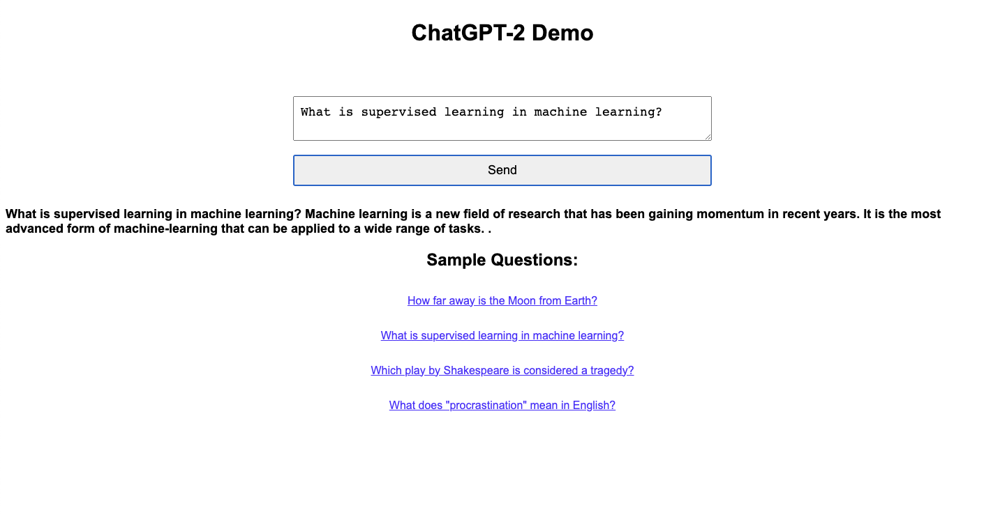
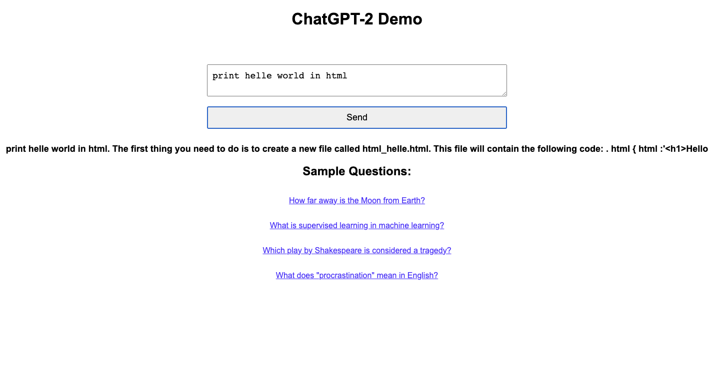
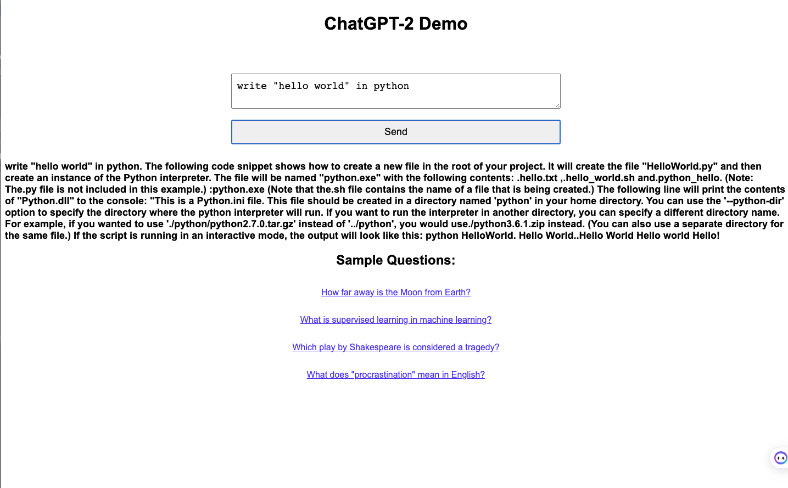

# ChatGPT-2 Demo

基于 chatGpt-2实现与Ai对话功能。  
在本地部署ChatGPT-2模型，并实现一个简单的对话客户端（基于flask）。   


## 环境准备

确保您已安装以下依赖：

- Python 3.6 或更高版本
- pip

## 安装

1. 克隆项目：

```shell
 git clone https://github.com/jianwi/chatGpt2-demo.git
```
2. 安装所需依赖：
```shell
pip install -r requirements.txt
```

## 使用方法

1. 运行Flask API：
```shell
python app.py
```

默认情况下，API将在`http://127.0.0.1:5000/`上运行。

在浏览器中打开`http://127.0.0.1:5000/`，您将看到一个简单的前端页面，可以输入问题并获取GPT-2生成的回复。

## 注意事项

- 可以根据需要调整GPT-2模型的参数，以获得更高质量的生成结果。
比如增加max_length的值，可以输出更多字符。
- 如果运行不起来，可能需要安装 PyTorch库:
```shell
pip install torch
```

## 演示


在html中显示hello world


调节max_length值，输出更多字符

